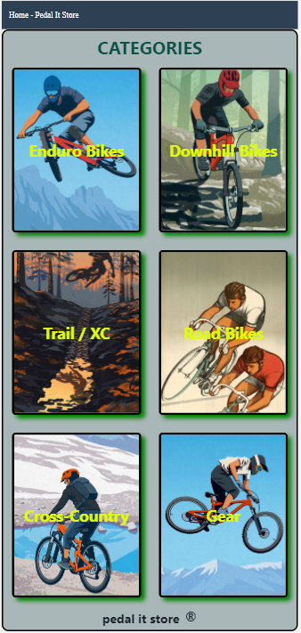
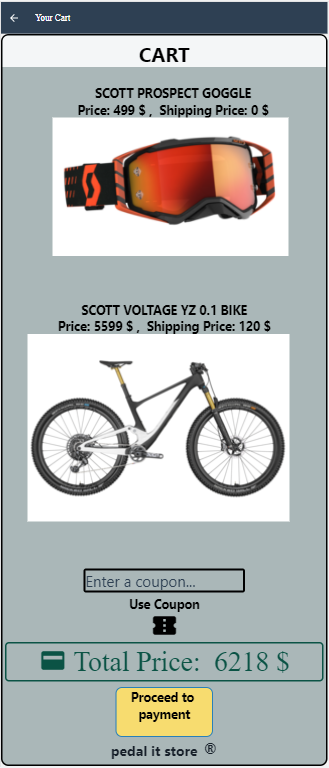

<h1 style="color: #E74C3C"><u><b>PEDAL IT STORE</b></u></h1>

<h2 style="color: #1ABC9C"><u><b>Description:</b></u></h2>

 "PedalIt Store" a store that offers 5 types of bicycles, in different types of riding: 
- Enduro Bikes  - Downhill Bikes  - Trail/XC Bikes  - Road Bikes  - Cross-Country Bikes  The store also offers a collection of the most advanced equipment on the market  

 

<h1 style="color: #F1C40F"><b>Screens</b></h1>

<h1>Home Page</h1>
<h2>In this screen, the buyer can check the categories of the store</h2>

 
 
<h1>Products Screens</h1>
<h2>In this screen, the buyer can check the products that are available in the store</h2>

 
 

 
 
<h1>Description Screens</h1>
<h2>In this screen, the buyer can read about the product and check if it fits for his need and budget</h2>

 
 

 
 
<h1>Cart Screen</h1>
<h2>In this screen, the buyer will see all his choises that he choose from the store</h2>

 
 
<h1>Details Screen</h1>
<h2>In this screen, the buyer need to enter his personal details and credit card details</h2>

 
 
<h1>Order Submitted Screen</h1>
<h2>In this screen, the buyer can see that the order went through successfully</h2>

<h2>The buyer can press on " Continue Shopping " and it will take him to the categories screen</h2>
 
 
<h3 style="color: #1ABC9C"><b>Made by Igor & Vova</b></h3>
